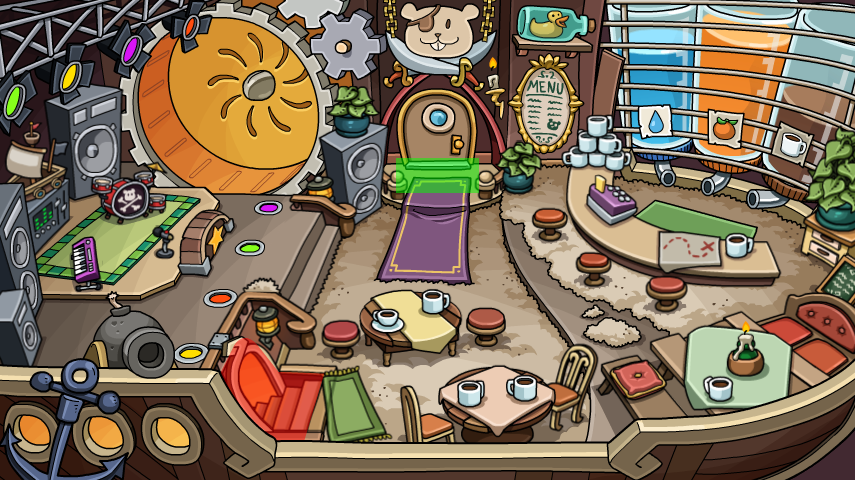

# Trigger

<figure><figcaption></figcaption></figure>

A `Trigger` is a class used to represent any area of a room that joins another room, grants an item, opens a mini-game, grants an `egg`, etc. Triggers are determined by the `treasure.png` of a room, previously called `map.png`, `map_server.png`, and or `map_client.png`. **All** triggers will have the `hex` property so the game knows what the HEX color is of the collider in the invisible image. Whenever the player moves, the game checks the HEX color of where the critter is standing to see if a trigger should be ran.

| Key | Type     | Description                                              |
| --- | -------- | -------------------------------------------------------- |
| hex | `string` | The HEX code used to identify the trigger inside the PNG |

### World Triggers

If the trigger has the `world` property, it has world modifiers (all are optional, some may be present, some may not) listed below:

| Key         | Type     | Description                                                            |
| ----------- | -------- | ---------------------------------------------------------------------- |
| joinRoom`?` | `string` | The room ID the player should be put in when this trigger is activated |

### Room Triggers

If the trigger has the `room` property, it has room modifiers (all are optional, some may be present, some may not) listed below:

| Key     | Type            | Description                                                                    |
| ------- | --------------- | ------------------------------------------------------------------------------ |
| show`?` | `Array<string>` | A list of room object IDs that should be shown when this trigger is activated  |
| hide`?` | `Array<string>` | A list of room object IDs that should be hidden when this trigger is activated |

### Server Triggers

If the trigger has the `server` property, it has server modifiers (all are optional, some may be present, some may not) listed below:

| Key          | Type                        | Description                                                                                                             |
| ------------ | --------------------------- | ----------------------------------------------------------------------------------------------------------------------- |
| grantItem`?` | `string (OR) Array<string>` | The item ID(s) of the item(s) the server should award the player when this trigger is activated                         |
| hasItems`?`  | `Array<string>`             | A list of item ID(s) of item(s) the player is required to have for the functions of this trigger to run when activated  |
| joinGame`?`  | `string`                    | Opens the mini-game with the specified ID on the sidebar of the game canvas (needs confirmation)                        |
| addEgg`?`    | `string`                    | Adds the specified egg to the array of found scavenger items, used in the event of a scavenger hunt such as an egg hunt |

### `"server2"` Triggers

`server2` triggers were only used in the Port room, for the mini-game triggers. Though, the regular server triggers also have a `joinGame` property.
